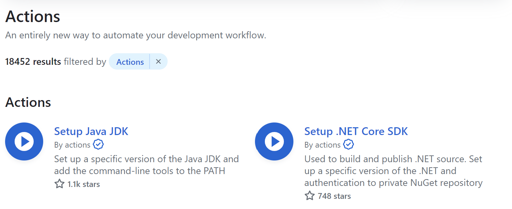

# Building Custom Actions

1. Javascript Actions
   - You write the logics in javascript.
   - Use Javascript (NodeJS) + any packages of your choice
2. Docker Actions
   - Containerized action
   - Define `Dockerfile` and `image`s
   - Perform tasks of your choice
   - A lot of flexibility but requires the knowledge of Docker
3. Composite Actions
   - Combine multiple workflow steps in one single Action
   - Combine `run`s and `uses`
   - Allows for reusing shared `Steps`

## Composite Actions

### Creating Custom Action

In the `deploy.yml`, we have few jobs that repeat. You can import actions that are from any public repository as needed.

We will create a new folder `actions` (or any name of your choice) under `.github`. In this example, we will separate the logics of caching the dependencies and installations.

```yml
  - name: Cache dependencies
      id: cache
      uses: actions/cache@v3
      with:
         path: node_modules
         key: deps-node-modules-${{ hashFiles('**/package-lock.json') }}
   - name: Install dependencies
      if: steps.cache.outputs.cache-hit != 'true'
      run: npm ci
```

No matter what kind of custom action you create, you always must create `action.yml` file. This file must inlcude the configuration and definition of that action. The action must include the following items.

- Name : The action name
- Description : The description of the action. It is displayed on the marketplace. So it is nice to have thsi value.
- Runs: must include runs -> using -> composite
- 

[Runs for composite actions](https://docs.github.com/en/actions/creating-actions/metadata-syntax-for-github-actions#runs-for-composite-actions)

We will add steps now. In the steps, if we are using the `run` command, we must always provide `shell` value.

```yml
steps:
  - name: Install dependencies
    if: steps.cache.outputs.cache-hit != 'true'
    run: npm ci
    shell: bash
```

Also, you are free to use other actions in your custom actions.

### Importing custom action

You use `uses` in the steps to import your custom action.

```yml
jobs:
  lint:
    runs-on: ubuntu-latest
    steps:
      - name: Get code
        uses: actions/checkout@v3
      - name: Load & Cache dependencies
        uses: {user}/{repo}/{path to action}
```

You can use action imported from other repo you have an access to or you can use action within your repository by providing the path from the root.

```yml
- name: Load & Cache dependencies
  uses: ./.github/actions/cache-deps/action.yml
```

Or you dont need to explicitly declare `action.yml`. It will automatically search for the `action.yml` file so you could just end up with the following.

```yml
- name: Load & Cache dependencies
  uses: ./.github/actions/cache-deps
```
